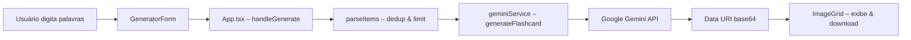

# Vocabulary Flashcard Generator

Aplicação web que gera flashcards de vocabulário infantil usando IA generativa (Google Gemini). Suporta dois modos de ilustração — **preto e branco** e **colorido** — com download individual de cada cartão gerado.

---

## Sumário
- [Stack & Requisitos](#stack--requisitos)
- [Instalação](#instalação)
- [Configuração](#configuração)
- [Execução & Scripts](#execução--scripts)
- [Uso](#uso)
- [Arquitetura & Estrutura](#arquitetura--estrutura)
- [Testes & Qualidade](#testes--qualidade)
- [Deploy](#deploy)
- [Troubleshooting](#troubleshooting)
- [Contribuição](#contribuição)
- [Melhorias Futuras](#melhorias-futuras)
- [Licença](#licença)
- [Changelog](#changelog)

---

## Stack & Requisitos

| Tecnologia | Versão |
|------------|--------|
| Node.js | ≥ 18 (recomendado) |
| React | 19 |
| Vite | 6 |
| TypeScript | ~5.8 |
| @google/genai | ^1.38.0 |
| Gerenciador de pacotes | npm |
| CSS | Tailwind CSS (via CDN) |
| Testes | Vitest + jsdom |

---

## Instalação

```bash
# clonar o repositório
git clone https://github.com/<seu-usuario>/vocabulary-flashcard-generator.git
cd vocabulary-flashcard-generator

# instalar dependências
npm install
```

---

## Configuração

Crie um arquivo `.env.local` na raiz do projeto com as variáveis abaixo:

```env
GEMINI_API_KEY=<sua-chave-da-api-gemini>
GEMINI_MODEL=gemini-2.5-flash-image   # opcional
```

| Variável | Obrigatória | Default | Descrição |
|----------|:-----------:|---------|-----------|
| `GEMINI_API_KEY` | ✅ | — | Chave da API Google Gemini. Injetada via `vite.config.ts` como `process.env.GEMINI_API_KEY`. |
| `GEMINI_MODEL` | ❌ | `gemini-2.5-flash-image` | Modelo Gemini utilizado para geração de imagens. Pode ser alterado para versões mais recentes. |

> [!IMPORTANT]
> O arquivo `.env.local` está no `.gitignore` — **nunca** versione suas chaves de API.

---

## Execução & Scripts

| Script | Comando | Descrição |
|--------|---------|-----------|
| Dev server | `npm run dev` | Inicia o Vite em `http://localhost:3000` com hot reload. |
| Build | `npm run build` | Gera bundle de produção em `dist/`. |
| Preview | `npm run preview` | Serve localmente o conteúdo de `dist/`. |
| Testes | `npm run test` | Executa os testes com Vitest. |

```bash
# workflow mais comum durante o desenvolvimento
npm run dev
```

---

## Uso

1. Inicie o servidor local com `npm run dev`.
2. Acesse `http://localhost:3000` no navegador.
3. Digite uma lista de palavras separadas por vírgula (ex.: `apple, book, car`).
4. (Opcional) Ative o toggle **🎨 Colored flashcards** para gerar cartões coloridos.
5. Clique em **Generate Flashcards**.
6. Aguarde a geração — as requisições são enviadas em lotes de 4 itens simultâneos.
7. Passe o mouse sobre cada cartão e clique em **Download** para salvar a imagem.

> [!NOTE]
> - O limite padrão é de **20 itens** por geração (definido em `utils/items.ts`).
> - Duplicatas (case-insensitive) são automaticamente removidas.
> - Cada item aceita no máximo **60 caracteres**.
> - Nomes de download seguem o padrão `<palavra>_flashcard.png` ou `<palavra>_color_flashcard.png`.

---

## Arquitetura & Estrutura

SPA em React + TypeScript: recebe entrada textual, chama a API Gemini para gerar uma imagem de flashcard por item e renderiza os cartões com opção de download.

```
.
├── .env.local                # Variáveis de ambiente (não versionado)
├── .github/
│   └── .prompts/             # Prompts de automação (ex.: geração de README)
├── __tests__/
│   ├── geminiService.test.ts # Testes do serviço Gemini
│   └── items.test.ts         # Testes do utilitário de parsing
├── components/
│   ├── GeneratorForm.tsx     # Formulário de entrada + toggle de cor
│   ├── Header.tsx            # Hero / título da página
│   ├── Icons.tsx             # Ícones SVG inline (Sparkles, Download)
│   ├── ImageGrid.tsx         # Galeria responsiva com overlay de download
│   └── Spinner.tsx           # Indicador de carregamento
├── services/
│   └── geminiService.ts      # Prompt engineering + chamada @google/genai
├── utils/
│   └── items.ts              # Parsing, dedup e limitação de itens
├── App.tsx                   # Shell principal: estado, orquestração e layout
├── index.html                # HTML entry-point (Tailwind via CDN)
├── index.tsx                 # Bootstrap React (createRoot)
├── types.ts                  # Tipos compartilhados (CardData)
├── vite.config.ts            # Configuração Vite (env, aliases, vitest)
├── tsconfig.json             # Configuração TypeScript
└── package.json              # Dependências e scripts
```

### Fluxo de dados



---

## Testes & Qualidade

O projeto utiliza **Vitest** com ambiente **jsdom**.

```bash
# executar todos os testes
npm run test
```

| Arquivo | Cobertura |
|---------|-----------|
| `__tests__/geminiService.test.ts` | Extração de dados de imagem da resposta Gemini |
| `__tests__/items.test.ts` | Parsing, deduplicação e limite de itens |

> [!TIP]
> Para rodar os testes em modo watch durante o desenvolvimento: `npx vitest --watch`

---

## Deploy

1. Configure `GEMINI_API_KEY` no ambiente de hospedagem.
2. Gere o bundle de produção:
   ```bash
   npm run build
   ```
3. Sirva o conteúdo de `dist/` em qualquer host estático:
   - **Vercel** · **Netlify** · **GitHub Pages** · **Azure Static Web Apps**

> [!WARNING]
> A chave da API Gemini é exposta no bundle do cliente (injetada via `define` no Vite). Para produção, considere implementar um proxy/backend que mantenha a chave segura no servidor.

---

## Troubleshooting

| Problema | Solução |
|----------|---------|
| `Gemini API key missing` | Defina `GEMINI_API_KEY` em `.env.local` e reinicie o dev server. |
| Falha ao gerar imagens | Verifique chave, quota e conectividade. O serviço tenta até **3 vezes** com back-off exponencial para erros transitórios (429, 500, 503, timeout). |
| Saída vazia / nenhum cartão | Confirme que a lista não está vazia e está separada por vírgulas. Items com mais de 60 caracteres são rejeitados. |
| Imagem retornada como texto | Verifique os logs do console — o modelo pode ter respondido com texto em vez de imagem. Tente novamente ou altere o `GEMINI_MODEL`. |

---

## Contribuição

1. Fork o repositório.
2. Crie uma branch: `git checkout -b feature/minha-feature`.
3. Faça commit das alterações: `git commit -m "feat: descrição"`.
4. Push para a branch: `git push origin feature/minha-feature`.
5. Abra um Pull Request.

> TODO: Definir padrões de código (ESLint/Prettier), checklist de PR e templates de issues.

---

## Melhorias Futuras

- Criação de perfil de usuário para personalizar preferências.
- Persistência de flashcards já gerados para reutilização em solicitações idênticas.
- Opções avançadas de saída: nível de detalhes do desenho, estilos adicionais.
- Proxy/backend para proteger a chave da API em produção.

---

## Licença

TODO: Adicionar arquivo `LICENSE` e badge correspondente.

---

## Changelog

| Data | Alteração |
|------|-----------|
| 2026-02-22 | Adicionado modo de flashcards coloridos (`isColored` toggle). |
| 2026-02-22 | Melhoria nos prompts do Gemini para consistência visual (Montserrat 800, layout fixo). |
| 2026-02-22 | README reescrito seguindo template padronizado. |
